# Using STS+SPA to ensure the SQL compatibility and performance when ADB upgrade

## Background

Lots of customers choose to use Oracle Autonomous Database in their production environments. But because the ADB (Autonomous Database) is a managed environment, the database will be patched or upgraded according to Oracle's plan. Although there are notifications in advance to help the customers to make their own plans to get over the upgrade. Some customers still have concerns about the performance or compatibility of the SQL statements after the upgrade. 

Actually, there is a simple way to eliminate this kind of concern. Oracle SQL Tuning Set and SQL Performance Analyzer can help the customers to analyze the SQL statements' performance and compatibility in different situations, which include different versions of databases. SQL Performance Analyzer can analyze the SQL Tuning Set and generate an intuitive report to review. From the report, we can easily get information like how many SQL statements have been evaluated, how many, and which of them have improved/regressed/unchanged performance. If there is any problem with executing the statements in the new environment, the report could also tell you about the details.

Please note that all of this is FREE in Oracle Autonomous Database. We can use these features without any extra charge.

## Environment

We assume that the situation is that we are doing the preparation for the upgrade from 19c to 21c of ADB. So in this article, we will describe: 

1. Capture the STS (SQL Tuning Set) from the production environment (ADB 19c) 
2. Transfer the STS to the test environment (ADB 21c)
3. Analyze the STS with SPA and generate a report in the test environment (ADB 21c).

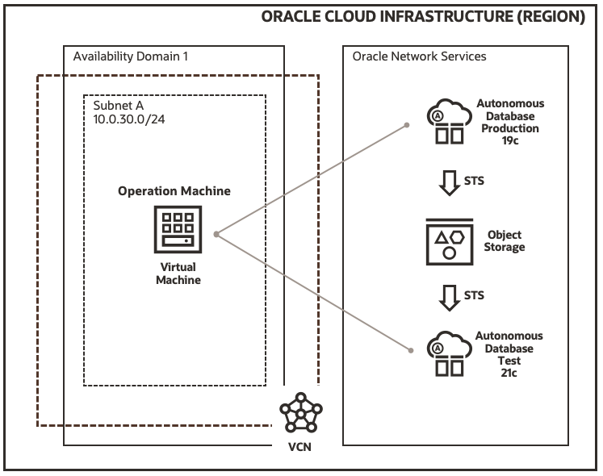

Since Oracle Database 21c is just released, we can only provision 21c instances in always free tier for now. But when you really need to concern about the version upgrade, 21c will be available as the same as the 19c in OCI.

In this article, We focus on how to use STS and SPA to analyze the performance and compatibility of the SQL statements in ADB environments. So how to provision the compute instance and the ADB instances will not be covered here.

## Preparation

There are some preparations we need to do before we start the real work. Because they are out of the focus of this article, I will list them here without a detailed explanation.

1. Install [Oracle Instant Client](https://www.oracle.com/database/technologies/instant-client/downloads.html) in the compute instance. Version 18.5 is recommended because the client version should not be greater than the Database version. Following packages are required.
   - Basic Package
   - SQL*Plus Package
   - Tools Package
2. Download the Wallet file from the ADW instances respectively and put them into the compute instance which will be used as the operation machine.
3. Unzip the Wallet files, edit `sqlnet.ora` and configure the `TNS_ADMIN` environment variable appropriately.
4. Use `sqlplus` to test the connection to the ADB instances can be successful.
5. Create an OCI Object Storage bucket which will be used as the intermediate storage for the captured STS.
6. [Generate an OCI auth token](https://docs.oracle.com/en-us/iaas/Content/Identity/Tasks/managingcredentials.htm#three) which will be used to create the credentials in the ADB instances.

## Capture SQL Tuning Set

Once we have completed the preparation works, we can start to capture the STS in the ADB 19c instance. In this example, I will create a schema called `MYSH` and copy tables `COUNTRIES`, `CHANNELS` and `SALES` from the ADB built-in sample schema `SH`. Then I will perform some super easy SQL statements against these tables and capture them into the STS. 

In the real production environment, you may need to consider which schema and which SQL statements should be captured and evaluated.

### Create schema `MYSH`

Connect to the ADB 19c instance as the `admin` user. Perform the following statements to create a new schema `MYSH`.

```sql
CREATE USER MYSH IDENTIFIED BY <PASSWORD>;
GRANT DWROLE TO MYSH;
GRANT UNLIMITED TABLESPACE TO MYSH;
```

### Copy tables from sample SH schema

Continue the connection as user `admin` and perform the following statements to copy table `COUNTRIES`, `CHANNELS` and `SALES`.

```sql
create table MYSH.CHANNELS as select * from SH.CHANNELS;
create table MYSH.COUNTRIES as select * from SH.COUNTRIES;
create table MYSH.SALES as select * from SH.SALES;

select count(1) from MYSH.CHANNELS;
select count(1) from MYSH.COUNTRIES;
select count(1) from MYSH.SALES;
```

### Simulate workload

Connect to the ADB 19c instance as the `MYSH` user. Perform the following statements to simulate some workload.

```sql
select count(1) from COUNTRIES;
select count(1) from channels;
select count(1) from sales;
select * from countries;
select * from channels;
select * from channels where channel_id = 3;
select * from sales where cust_id = 512 and prod_id = 119;
insert into channels (CHANNEL_ID, CHANNEL_DESC, CHANNEL_CLASS, CHANNEL_CLASS_ID, CHANNEL_TOTAL, CHANNEL_TOTAL_ID) values(1, 'Sample 1 desc', 'Sample 1 class', 11, 'Channel total', 1);
update channels set CHANNEL_DESC='New desc' where CHANNEL_ID=1;
delete from channels where channel_id = 3;
commit;
```

### Create STS

Now we have performed some SQL statements to simulate the workloads. They are super simple but good enough to explain the process. 

Connect to the ADB 19c instance as `admin` and perform the below statement to create a SQL Tuning Set.

```sql
EXEC DBMS_SQLTUNE.CREATE_SQLSET(sqlset_name => 'mysh_sts_test');
```

If this is not the first time we do this test, we may encounter an error `ORA-13753: "SQL Tuning Set" "mysh_sts_test" already exists for user "ADMIN".`. We can fix it by dropping the created STS with the following statement.

```sql
EXEC DBMS_SQLTUNE.DROP_SQLSET('mysh_sts_test');
```

### Populate STS

Following is a sample of how to filter, select and populate the SQL Tuning Set. Please pay attention to the filter part, because it controls what kind of SQL statements will be captured into the tuning set. 

According to my filter, I only filtered out the SQL Tuning Set related statements. That means all the `SELECT`, `UPDATE`, `DELETE` and `INSERT` statements I performed above should also be captured.

```sql
DECLARE
    l_cursor  DBMS_SQLTUNE.SQLSET_CURSOR;
BEGIN
    OPEN l_cursor FOR
    SELECT VALUE(a) FROM   TABLE(
        DBMS_SQLTUNE.SELECT_CURSOR_CACHE(
        basic_filter=> 'upper(SQL_TEXT) not like ''%SQL_ANALYZE%''
        and upper(SQL_TEXT) not like ''%BEGIN%''
        and upper(SQL_TEXT) not like ''%DBMS_SQLTUNE%''
        and upper(parsing_schema_name) = ''MYSH''',
        attribute_list => 'ALL')) a;
    DBMS_SQLTUNE.load_sqlset(sqlset_name=>
        'mysh_sts_test',populate_cursor => l_cursor);
END;
/
```

### List the captured SQL statements

The SQL Tuning Set has been created and populated. We can query what SQL statements are captured by performing the following statement. As you can see, only `SELECT` statements are captured into STS. The `INSERT` statement was filtered out.

```sql
SELECT sql_id, sql_text
FROM   dba_sqlset_statements
WHERE  sqlset_name = 'mysh_sts_test'
ORDER BY 1
;
```

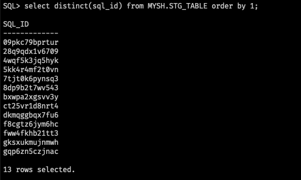

Until now, the capture SQL Tuning Set part is completed. We simulated some SQL statements as a general workload. Then we filtered the specific statements we want to analyze and populated them into the tuning set. What we need to do next is transfer the STS to the ADB 21c instance which is our test environment.

## Transfer STS

We cannot directly transfer the STS from one ADB instance into another. So we need to export the STS to an intermediate place, then import it into the target instance. The obvious choice would be the OCI Object Storage because it is accessible for any ADB instance no matter as an export target or an import source.

Also, SQL Tuning Set cannot be exported directly, we need to pack the tuning set into a staging table and transfer the staging table accordingly. 

### Create staging table

Connect to the ADB 19c instance as `admin` and perform the following statements to create a staging table to store the SQL Tuning Set. This staging table is created in the `MYSH` schema.


```sql
DROP TABLE MYSH.STG_TABLE PURGE;
BEGIN
    DBMS_SQLTUNE.CREATE_STGTAB_SQLSET (
        table_name => 'STG_TABLE',
        schema_name => 'MYSH',
        tablespace_name =>'DATA'
    );
END;
/

SELECT COUNT(1) FROM MYSH.STG_TABLE;
```

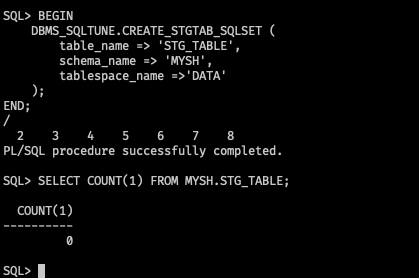

### Pack the STS into the staging table

Once the staging table is created, perform the following statements to pack the SQL Tuning Set into it.

```sql
BEGIN
    DBMS_SQLTUNE.PACK_STGTAB_SQLSET (
        sqlset_name => 'mysh_sts_test',
        sqlset_owner => 'ADMIN', 
        staging_table_name => 'STG_TABLE',
        staging_schema_owner => 'MYSH'
    );
END;
/
```

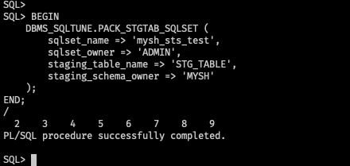

Let's have a quick check of the staging table, we should be able to see 6 unique `sql_id` in this example.

```sql
select distinct(sql_id) from MYSH.STG_TABLE order by 1;
```


### Create credential in ADB 19c

The staging table is ready, next, we will export it to the Object Storage bucket by using the traditional way `expdp`. To do so, we need to use the auth token to create a credential in the ADB instance first, so that the ADB instance will be able to access and export to the bucket directly.

Perform the following statements to create the credential.

```sql
SET DEFINE OFF
BEGIN
  DBMS_CLOUD.CREATE_CREDENTIAL(
    credential_name => 'REX_CRED',
    username => '<USERNAME>',
    password => '<AUTH TOKEN>'
  );
END;
/

-- List the credential
SELECT credential_name, username, comments FROM all_credentials;

-- set default credential
ALTER DATABASE PROPERTY SET DEFAULT_CREDENTIAL = 'ADMIN.REX_CRED';
```

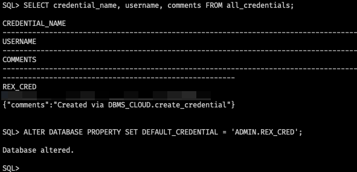

### Export staging table

Exit from the sqlplus and we use `expdp` to do the export. The sample schema `MYSH` is not big so I export the whole scheme instead of exporting the single staging table.

```sh
expdp admin/<PASSWORD>@rexadb19_high \
    schemas=MYSH \
    dumpfile=default_credential:https://objectstorage.ap-tokyo-1.oraclecloud.com/n/<COMPARTMENT>/b/<BUCKET>/o/mysh_sts_19c.dmp \
    parallel=2 \
    encryption_pwd_prompt=yes \
    logfile=export_mysh_sts_19c.log \
    directory=data_pump_dir
```


We can verify the exported dump file in the bucket.

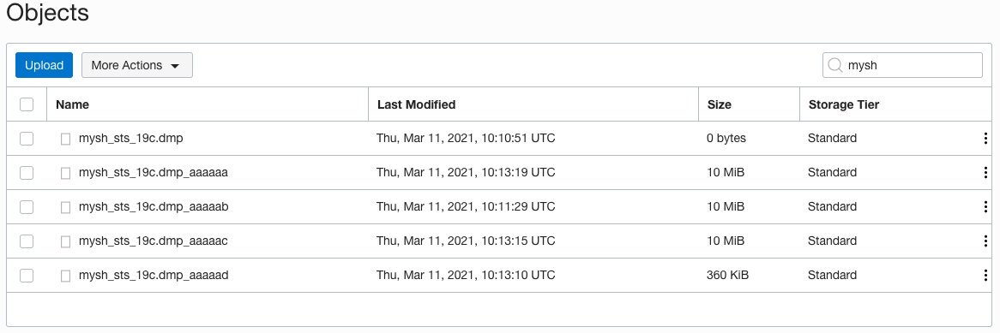


### Create credential in ADB 21c

Connect to the ADB 21c instance as `admin`. 
Use the same procedure to create a credential in the ADB 21c instance. So it will be able to access and import the data from the dump file in Object Storage.

```sql
SET DEFINE OFF
BEGIN
  DBMS_CLOUD.CREATE_CREDENTIAL(
    credential_name => 'REX_CRED',
    username => '<USERNAME>',
    password => '<AUTH TOKEN>'
  );
END;
/
SELECT credential_name, username, comments FROM all_credentials;
```

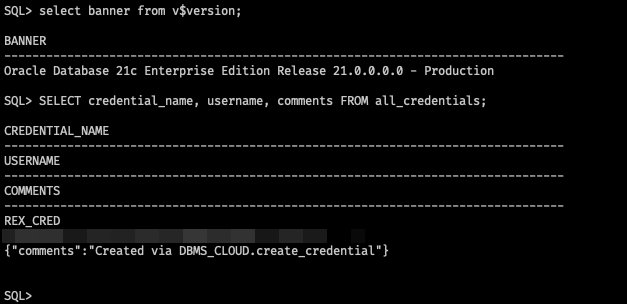

### Import dump file

Exit from the sqlplus, perform the following statements to import the dump file.

```sh
impdp admin/<PASSWORD>@rexadb21_high \
    directory=data_pump_dir \
    credential=REX_CRED \
    dumpfile= https://objectstorage.ap-tokyo-1.oraclecloud.com/n/<COMPARTMENT>/b/<BUCKET>/o/mysh_sts_19c.dmp \
    parallel=2 \
    encryption_pwd_prompt=yes \
    transform=segment_attributes:n \
    transform=dwcs_cvt_iots:y transform=constraint_use_default_index:y \
    exclude=cluster,indextype,db_link
```

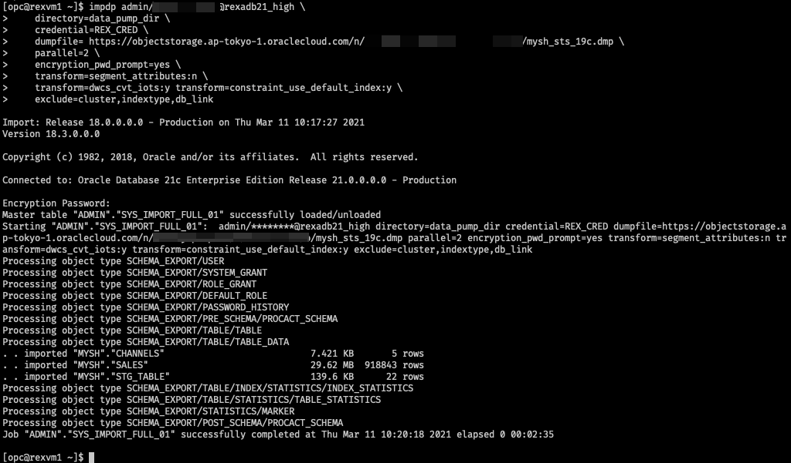

## Analyze the STS and generate report

### Unpack the staging table

The SQL Tuning Set we captured from the ADB 19c instance was packed into the staging table. Now, we need to unpack it back to the tuning set in the 21c instance.

Connect to the ADB 21c instance as `admin` and perform the following statements.

```sql
BEGIN
    DBMS_SQLTUNE.UNPACK_STGTAB_SQLSET (
        sqlset_name => 'mysh_sts_test',
        sqlset_owner => 'ADMIN',
        replace => TRUE,
        staging_table_name => 'STG_TABLE',
        staging_schema_owner => 'MYSH'
    );
END;
/
```

If you encounter the error `ORA-13757`, please refer to the section [Clean up](#clean-up).

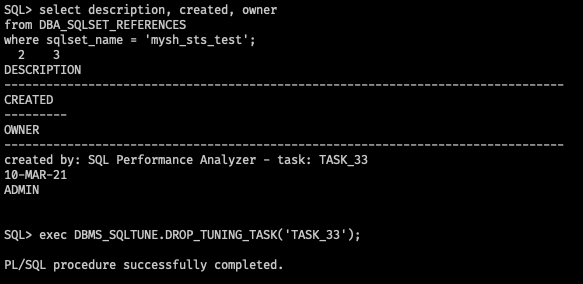

### Create SPA task

Before we start to analyze the SQL Tuning Set, we need to create a SQL Performance Analyzer task first.

```sql
VARIABLE spa_task VARCHAR2(64);
EXEC :spa_task := DBMS_SQLPA.CREATE_ANALYSIS_TASK(sqlset_owner => 'ADMIN', sqlset_name => 'mysh_sts_test');
PRINT :spa_task
```

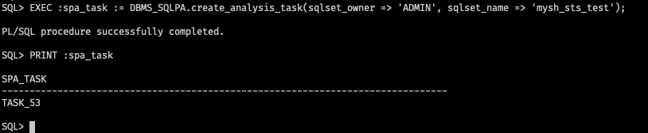

### Execute analysis task - 19c

Although in the 21c environment, we can still analyze the SQL Tuning Set by specifying the execution_type as `CONVERT SQLSET`. This can help us to read the captured statistics in the SQL Tuning Set and model them as a task execution.

```sql
BEGIN
    DBMS_SQLPA.EXECUTE_ANALYSIS_TASK(
    task_name => :spa_task,
    execution_type => 'CONVERT SQLSET' ,
    execution_name => '19c_preupgrade');
END;
/
```

### Simulate a SQL error

We want to see if there are any SQL errors in the 21c environment, so I will drop the `CHANNELS` table to generate a man-made SQL error.

```sql
DROP TABLE MYSH.COUNTRIES PURGE;
```

### Execute analysis task - 21c

We need to analyze the SQL Tuning Set again, but this time we specify the execution_type as `TEST EXECUTE`. This will execute every SQL statement in the SQL Tuning Set and collect its execution plans and execution statistics.

```sql
BEGIN
    DBMS_SQLPA.execute_analysis_task(
    task_name       => :spa_task,
    execution_type  => 'TEST EXECUTE',
    execution_name  => '21c_adb');
END;
/
```

### Execute analysis task - Compare

Once again, we execute the analysis task to analyze and compare the two versions of the SQL performance data we generated just now. Please note that the execution_type is specified as `COMPARE PERFORMANCE`.

```sql
BEGIN
    DBMS_SQLPA.EXECUTE_ANALYSIS_TASK(
        task_name        => :spa_task,
        execution_type   => 'COMPARE PERFORMANCE', 
        execution_params => dbms_advisor.arglist(
                        'execution_name1', 
                        '19c_preupgrade', 
                        'execution_name2', 
                        '21c_adb',
                        'workload_impact_threshold', 0, 
                        'sql_impact_threshold', 0));
END;
/
```

### Generate report

Now, all the analysis tasks are completed, we analyzed the 19c statistics and we also analyzed the SQL statements execution in the 21c environment. In addition, we also did a comparison of the two. 

It's time to generate the report. Once the report is generated we can download it from the compute instance and review the result in any browser. 

```sql
SET PAGESIZE 0
SET LINESIZE 1000
SET LONG 1000000
SET LONGCHUNKSIZE 1000000
SET TRIMSPOOL ON
SET TRIM ON

SPOOL sts_19c_21c_execute_comparison_report.html
SELECT DBMS_SQLPA.report_analysis_task(:spa_task, 'ACTIVE', 'ALL') FROM dual;
SPOOL OFF
```


Review the report in a browser.

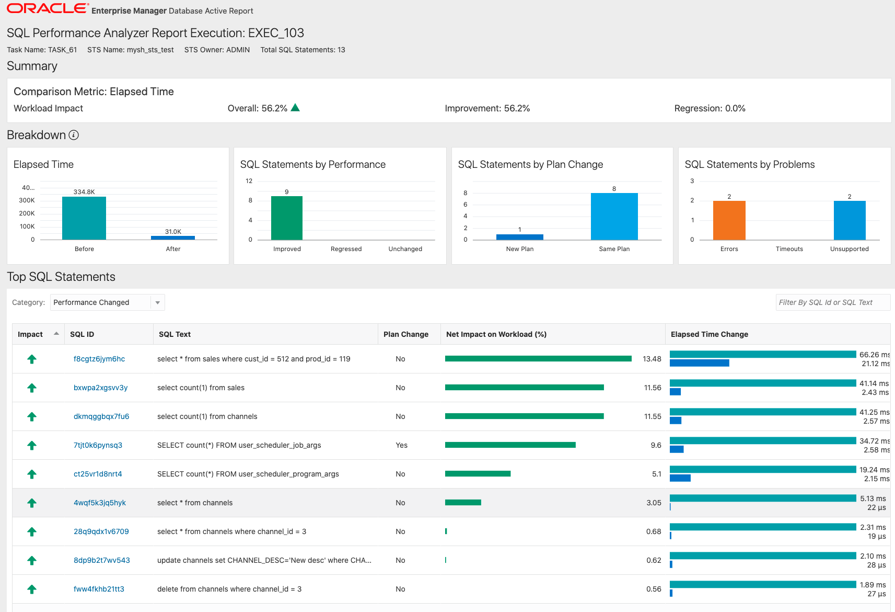

## Clean up

In any case, if you need to drop the SQL Tuning Set, you can perform the following procedure to do so.

```sql
EXEC DBMS_SQLTUNE.DROP_SQLSET('mysh_sts_test');
```

If you encounter an error states that `ORA-13757: "SQL Tuning Set" "mysh_sts_test" owned by user "ADMIN" is active.`, you could perform the following statements to find out the references of the STS, drop the references, and then drop the STS.

```sql
select description, created, owner
from DBA_SQLSET_REFERENCES
where sqlset_name = 'mysh_sts_test';

EXEC DBMS_SQLTUNE.DROP_TUNING_TASK('TASK_53');

EXEC DBMS_SQLTUNE.DROP_SQLSET('mysh_sts_test');
```

Perform the following statement can help you to verify whether a specific SQL Tuning Set exists.

```sql
SELECT COUNT(*) 
FROM   USER_SQLSET 
WHERE  NAME = 'mysh_sts_test';
```

## Supplement

In the example above we did not do much filter against the SQL statements. If we want to filter out a specific type of SQL statements, for example `SELECT`, we can do it like below.

```sql
DECLARE
    l_cursor  DBMS_SQLTUNE.sqlset_cursor;
BEGIN
    OPEN l_cursor FOR
    SELECT VALUE(a) FROM   TABLE(
        DBMS_SQLTUNE.select_cursor_cache(
        basic_filter=> 'upper(SQL_TEXT) not like
        ''%SQL_ANALYZE%''
        and upper(SQL_TEXT) not like ''%BEGIN%''
        and upper(SQL_TEXT) not like ''%DBMS_SQLTUNE%''
        and upper(SQL_TEXT) like ''%SELECT%''
        and upper(parsing_schema_name) = ''MYSH''',
        attribute_list => 'ALL')) a;
    DBMS_SQLTUNE.load_sqlset(sqlset_name=>
        'mysh_sts_test',populate_cursor => l_cursor);
END;
/
```

Accordingly, we will only capture the `SELECT` statements into the SQL Tuning Set and only the captured `SELECT` statements will be analyzed and evaluated in the report. 


## References

- [DBMS_SQLTUNE](https://docs.oracle.com/en/database/oracle/oracle-database/19/arpls/DBMS_SQLTUNE.html#GUID-821462BF-1695-41CF-AFF7-FD23E9999C6A)
- [DBMS_SQLPA](https://docs.oracle.com/en/database/oracle/oracle-database/19/arpls/DBMS_SQLPA.html#GUID-9AAF3672-1CF3-4354-AF41-5BA50BA295F8)
- [Use Oracle Data Pump to Export Data to Object Store Setting DEFAULT_CREDENTIAL Property](https://docs.oracle.com/en/cloud/paas/autonomous-database/adbsa/export-data-object-store-dp.html#GUID-9D1768A7-9FDE-448D-9925-C85FD48383E6)
- [Import Data Using Oracle Data Pump on Autonomous Database](https://docs.oracle.com/en/cloud/paas/autonomous-database/adbsa/load-data-data-pump.html#GUID-30DB1EEA-DB45-49EA-9E97-DF49A9968E24)
- [ORA-13757: Can't drop SQL Tuning Set (Doc ID 1276524.1)](https://support.oracle.com/epmos/faces/DocContentDisplay?id=1276524.1)
