# STS + SPA でADBアップグレード時にSQLの互換性とパフォーマンスを確保しましょう！

## 背景

多くのお客様は実環境で Oracle Autonomous Database を使用しています。ただし、Autonomous Database (ADB) はマネージド型の環境であるため、データベースには Oracle の計画に従ってパッチが適用またはアップグレードされます。事前に通知がありますが、お客様がアップグレードを乗り越えるための独自の計画を立てるのに役立ちます。 一部のお客様は、アップグレード後もSQLステートメントのパフォーマンスまたは互換性について懸念を抱いています。 

実際はこんな懸念を取り除く簡単な方法があります。Oracle SQL Tuning Set と SQL Performance Analyzer は、さまざまなバージョンのデータベースを含むさまざまな状況でのSQLステートメントのパフォーマンスと互換性を分析するのに役立ちます。SQL Performance Analyzerは、SQL Tuning Setを分析し、レビューする直感的なレポートを生成できます。レポートから、分析されたSQLステートメントが互換性があるか、パフォーマンスが向上/低下/変化していないかについての情報を簡単に取得できます。

Oracle Autonomous Databaseでは、これらすべてが無料であることに注意してください。 これらの機能は追加料金なしで使用できます。

## 環境

ADBの19cから21cへのアップグレードの準備をしている状況であると想定しています。 したがって、この記事では、以下について説明します。

1. 本番環境（ADB 19c）からSTS（SQL Tuning Set）をキャプチャします。
2. STSをテスト環境（ADB 21c）に転送します
3. SPAを使用してSTSを分析し、テスト環境（ADB 21c）でレポートを生成します。 

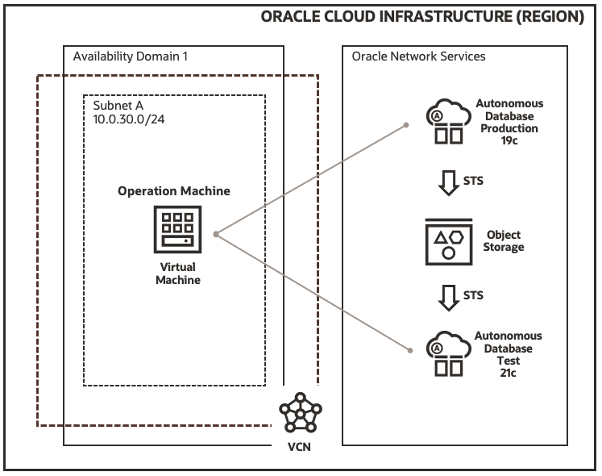

Oracle Database 21cがリリースされたばかりなので、現時点では、「Always free tier」で21cインスタンスのみをプロビジョニングできます。 ただし、バージョンのアップグレードについて本当に心配する必要がある時に19cと同じように21cを使用できると思います。

この記事では、STSとSPAを使用して、ADB環境でのSQLステートメントのパフォーマンスと互換性を分析する方法に焦点を当てます。 したがって、コンピューティングインスタンスとADBインスタンスをプロビジョニングする方法については、ここでは説明しません。

## 事前準備

実際の作業を開始する前に、いくつかの準備を行う必要があります。 それらはこの記事の焦点から外れているので、詳細な説明なしでここにリストします。

1. コンピューティングインスタンスに[Oracle Instant Client](https://www.oracle.com/database/technologies/instant-client/downloads.html)をインストールします。 クライアントのバージョンはデータベースのバージョンより大きくてはならないため、バージョン18.5をお勧めします。 以下のパッケージが必要です。
   - Basic Package
   - SQL*Plus Package
   - Tools Package
2. ADWインスタンスからそれぞれウォレットファイルをダウンロードし、オペレーションマシンとして使用されるコンピューティングインスタンスに配置します。
3. ウォレットファイルを解凍し、 `sqlnet.ora`を編集して、` TNS_ADMIN`環境変数を適切に設定します。
4. `sqlplus`を使用して、ADBインスタンスへの接続が成功するかどうかを確認します。
5. キャプチャされたSTSの中間ストレージとして使用されるOCIオブジェクトストレージバケットを作成します。
6. [OCI認証トークンを生成します](https://docs.oracle.com/en-us/iaas/Content/Identity/Tasks/managingcredentials.htm#three)。 これはADBインスタンスで資格情報(credentials)を作成するために使用されます。

## SQLチューニングセット(STS)のキャプチャ

準備作業が完了したら、ADB19cインスタンスでSTSのキャプチャを開始できます。 この例では、 `MYSH`というスキーマを作成し、ADBの組み込みサンプルスキーマ` SH`からテーブル `COUNTRIES`、`CHANNELS`と`SALES`をコピーします。 これらのテーブルに対していくつかの非常に簡単なSQLステートメントを実行し、それらをSTSにキャプチャします。

実稼働環境では、どのスキーマとどのSQLステートメントをキャプチャして評価するかを検討する必要がある場合があります。

### スキーマ `MYSH`の作成

`admin`ユーザーとしてADB 19cインスタンスに接続します。 次のステートメントを実行して、新しいスキーマ `MYSH`を作成します。

```sql
CREATE USER MYSH IDENTIFIED BY <PASSWORD>;
GRANT DWROLE TO MYSH;
GRANT UNLIMITED TABLESPACE TO MYSH;
```

### サンプルスキーマ(SH)からテーブルのコピー

ユーザー `admin`として接続し、次のステートメントを実行してテーブル`CHANNELS` と `SALES`をコピーします。

```sql
create table MYSH.CHANNELS as select * from SH.CHANNELS;
create table MYSH.COUNTRIES as select * from SH.COUNTRIES;
create table MYSH.SALES as select * from SH.SALES;

select count(1) from MYSH.CHANNELS;
select count(1) from MYSH.COUNTRIES;
select count(1) from MYSH.SALES;
```

### ワークロードのシミュレート

`MYSH`ユーザーとしてADB 19cインスタンスに接続します。 次のステートメントを実行して、いくつかのワークロードをシミュレートします。

```sql
select count(1) from COUNTRIES;
select count(1) from channels;
select count(1) from sales;
select * from countries;
select * from channels;
select * from channels where channel_id = 3;
select * from sales where cust_id = 512 and prod_id = 119;
insert into channels (CHANNEL_ID, CHANNEL_DESC, CHANNEL_CLASS, CHANNEL_CLASS_ID, CHANNEL_TOTAL, CHANNEL_TOTAL_ID) values(1, 'Sample 1 desc', 'Sample 1 class', 11, 'Channel total', 1);
update channels set CHANNEL_DESC='New desc' where CHANNEL_ID=1;
delete from channels where channel_id = 3;
commit;
```

### STSの作成

これで、ワークロードをシミュレートするためにいくつかのSQLステートメントを実行しました。 それらは非常に単純ですが、プロセスを説明するのに十分です。

`admin`としてADB19cインスタンスに接続し、以下のステートメントを実行してSQL Tuning Setを作成します。

```sql
EXEC DBMS_SQLTUNE.CREATE_SQLSET(sqlset_name => 'mysh_sts_test');
```

ORA-13753: "SQL Tuning Set" "mysh_sts_test" already exists for user "ADMIN".`が発生する場合、次のステートメントを使用して作成したSTSを削除することで修正できます。

```sql
EXEC DBMS_SQLTUNE.DROP_SQLSET('mysh_sts_test');
```

### STSのポピュレート

以下は、SQL Tuning Set をフィルタリング、選択、および設定する方法のサンプルです。 フィルタ部分は、チューニングセットにキャプチャされるSQLステートメントの種類を制御するため、注意してください。

私のフィルターによると、SQL TuningSet関連のステートメントのみをフィルターで除外しました。 つまり、上記で実行したすべての `SELECT`、` UPDATE`、 `DELETE`、および` INSERT`ステートメントをキャプチャするべきです。


```sql
DECLARE
    l_cursor  DBMS_SQLTUNE.SQLSET_CURSOR;
BEGIN
    OPEN l_cursor FOR
    SELECT VALUE(a) FROM   TABLE(
        DBMS_SQLTUNE.SELECT_CURSOR_CACHE(
        basic_filter=> 'upper(SQL_TEXT) not like ''%SQL_ANALYZE%''
        and upper(SQL_TEXT) not like ''%BEGIN%''
        and upper(SQL_TEXT) not like ''%DBMS_SQLTUNE%''
        and upper(parsing_schema_name) = ''MYSH''',
        attribute_list => 'ALL')) a;
    DBMS_SQLTUNE.load_sqlset(sqlset_name=>
        'mysh_sts_test',populate_cursor => l_cursor);
END;
/
```

### キャプチャされたSQLステートメントの表示

SQLチューニングセットが作成され、データが入力されました。 次のステートメントを実行することで、キャプチャされたSQLステートメントを照会できます。 ご覧のとおり、STSにキャプチャされるのは `SELECT`ステートメントのみです。 `INSERT`ステートメントは除外されました。

```sql
SELECT sql_id, sql_text
FROM   dba_sqlset_statements
WHERE  sqlset_name = 'mysh_sts_test'
ORDER BY 1
;
```

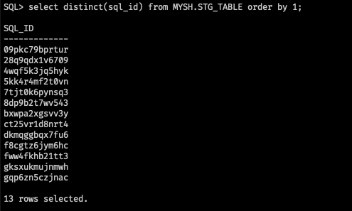

これまでに、SQL Tuning Setのキャプチャは完了しました。 一般的なワークロードとしていくつかのSQLステートメントをシミュレートしました。 分析する特定のステートメントをフィルタリングして、チューニングセットに入力しました。 次に行う必要なのは、STSをテスト環境であるADB 21cインスタンスに転送することです。

## STSの転送

STSをあるADBインスタンスから別のインスタンスに直接転送することはできません。 したがって、STSを中間場所にエクスポートしてから、ターゲットインスタンスにインポートする必要があります。 エクスポートターゲットまたはインポートソースに関係なく、すべてのADBインスタンスからアクセスできるため、当然の選択はOCIオブジェクトストレージです。

また、SQL Tuning Setを直接エクスポートすることはできません。チューニングセットをステージングテーブルにパックし、それに応じてステージングテーブルを転送する必要があります。

### ステージングテーブルの作成

`admin`としてADB 19cインスタンスに接続し、次のステートメントを実行して、SQLチューニングセットを格納するためのステージングテーブルを作成します。 このステージングテーブルは、 `MYSH`スキーマで作成されます。

```sql
DROP TABLE MYSH.STG_TABLE PURGE;
BEGIN
    DBMS_SQLTUNE.CREATE_STGTAB_SQLSET (
        table_name => 'STG_TABLE',
        schema_name => 'MYSH',
        tablespace_name =>'DATA'
    );
END;
/

SELECT COUNT(1) FROM MYSH.STG_TABLE;
```

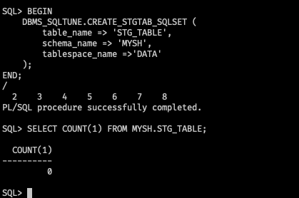

### STSをステージングテーブルにパック

ステージングテーブルが作成されたら、次のステートメントを実行して、SQLチューニングセットをそのテーブルにパックします。

```sql
BEGIN
    DBMS_SQLTUNE.PACK_STGTAB_SQLSET (
        sqlset_name => 'mysh_sts_test',
        sqlset_owner => 'ADMIN', 
        staging_table_name => 'STG_TABLE',
        staging_schema_owner => 'MYSH'
    );
END;
/
```

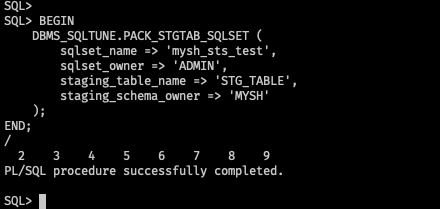

ステージングテーブルを簡単に確認してみましょう。この例では、6つの一意の `sql_id`を確認できるはずです。

```sql
select distinct(sql_id) from MYSH.STG_TABLE order by 1;
```


### ADB 19cで資格情報(credential)の作成

ステージングテーブルの準備ができました。次に、`expdp`を使用してオブジェクトストレージバケットにエクスポートします。 これを行うには、最初に認証トークンを使用してADBインスタンスに資格情報を作成し、ADBインスタンスがバケットに直接アクセスしてエクスポートできるようにする必要があります。

次のステートメントを実行して資格情報を作成します。

```sql
SET DEFINE OFF
BEGIN
  DBMS_CLOUD.CREATE_CREDENTIAL(
    credential_name => 'REX_CRED',
    username => '<USERNAME>',
    password => '<AUTH TOKEN>'
  );
END;
/

-- List the credential
SELECT credential_name, username, comments FROM all_credentials;

-- set default credential
ALTER DATABASE PROPERTY SET DEFAULT_CREDENTIAL = 'ADMIN.REX_CRED';
```

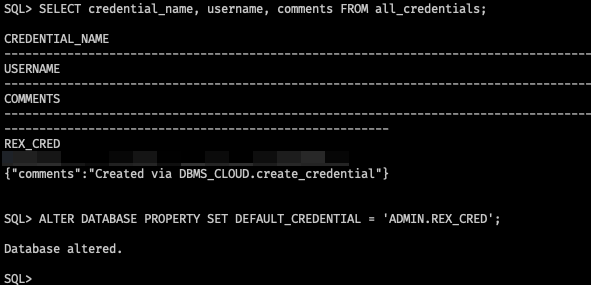

### ステージングテーブルのエクスポート

sqlplusを終了し、 `expdp`を使用してエクスポートを実行します。 サンプルスキーマ `MYSH`は大きくないので、単一のステージングテーブルをエクスポートする代わりに、スキーム全体をエクスポートします。

```sh
expdp admin/<PASSWORD>@rexadb19_high \
    schemas=MYSH \
    dumpfile=default_credential:https://objectstorage.ap-tokyo-1.oraclecloud.com/n/<COMPARTMENT>/b/<BUCKET>/o/mysh_sts_19c.dmp \
    parallel=2 \
    encryption_pwd_prompt=yes \
    logfile=export_mysh_sts_19c.log \
    directory=data_pump_dir
```

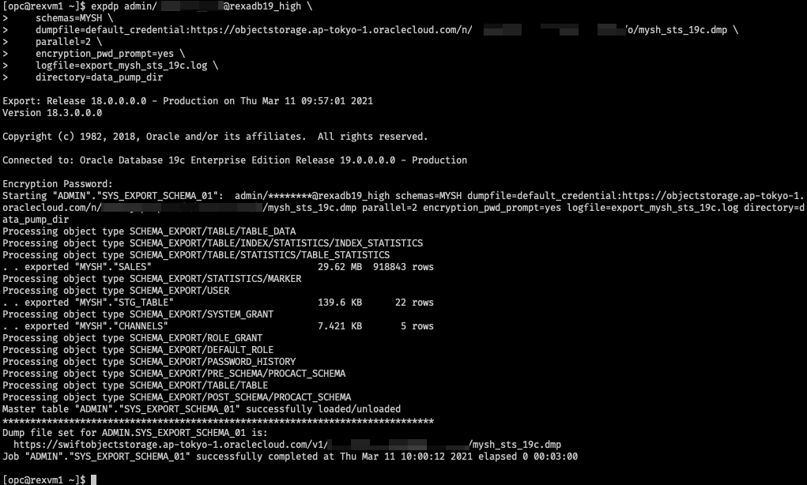

バケット内のエクスポートされたダンプファイルを確認できます。

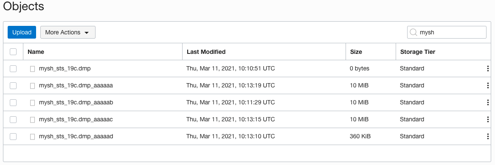


### ADB 21cで資格情報の作成

`admin`としてADB 21cインスタンスに接続します。
同じ手順を使用して、ADB 21cインスタンスに資格情報を作成します。Object Storageのダンプファイルからデータにアクセスしてインポートできるようになります。

```sql
SET DEFINE OFF
BEGIN
  DBMS_CLOUD.CREATE_CREDENTIAL(
    credential_name => 'REX_CRED',
    username => '<USERNAME>',
    password => '<AUTH TOKEN>'
  );
END;
/
SELECT credential_name, username, comments FROM all_credentials;
```

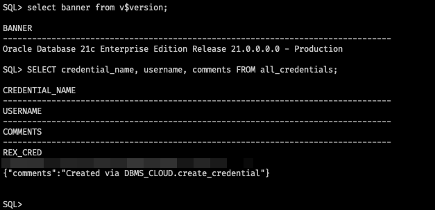

### ダンプファイルのインポート

sqlplusを終了し、次のステートメントを実行してダンプファイルをインポートします。

```sh
impdp admin/<PASSWORD>@rexadb21_high \
    directory=data_pump_dir \
    credential=REX_CRED \
    dumpfile= https://objectstorage.ap-tokyo-1.oraclecloud.com/n/<COMPARTMENT>/b/<BUCKET>/o/mysh_sts_19c.dmp \
    parallel=2 \
    encryption_pwd_prompt=yes \
    transform=segment_attributes:n \
    transform=dwcs_cvt_iots:y transform=constraint_use_default_index:y \
    exclude=cluster,indextype,db_link
```


## STSの分析、レポートの生成

### ステージングテーブルのアンパック

ADB 19cインスタンスからキャプチャしたSQL Tuning Setがステージングテーブルにパックされました。 21cインスタンスのチューニングセットにアンパックして戻す必要があります。

`admin`としてADB 21cインスタンスに接続し、次のステートメントを実行します。

```sql
BEGIN
    DBMS_SQLTUNE.UNPACK_STGTAB_SQLSET (
        sqlset_name => 'mysh_sts_test',
        sqlset_owner => 'ADMIN',
        replace => TRUE,
        staging_table_name => 'STG_TABLE',
        staging_schema_owner => 'MYSH'
    );
END;
/
```

エラー `ORA-13757`が発生した場合は、[クリーンアップ](#クリーンアップ)のセクションを参照してください。

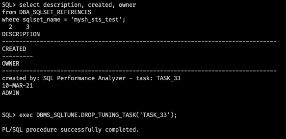

### SPAタスクの作成

SQL Tuning Setの分析を開始する前に、SQL Performance Analyzerタスクを作成する必要があります。

```sql
VARIABLE spa_task VARCHAR2(64);
EXEC :spa_task := DBMS_SQLPA.CREATE_ANALYSIS_TASK(sqlset_owner => 'ADMIN', sqlset_name => 'mysh_sts_test');
PRINT :spa_task
```

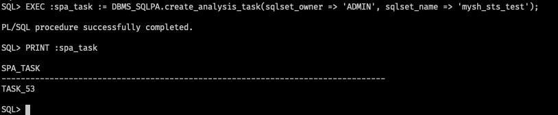

### 分析タスクの実行 - 19c

21c環境でも `execution_type` を `CONVERT SQLSET`として指定することでSQLチューニングセットを分析できます。 これはSQL Tuning Setでキャプチャされた統計情報を読み取り、それらをタスク実行としてモデル化するのに役立ちます。

```sql
BEGIN
    DBMS_SQLPA.EXECUTE_ANALYSIS_TASK(
    task_name => :spa_task,
    execution_type => 'CONVERT SQLSET' ,
    execution_name => '19c_preupgrade');
END;
/
```

### SQLエラーのシミュレート

21c環境にSQLエラーがあるかどうかを確認したいので、 `CHANNELS`テーブルを削除して人工のSQLエラーを生成します。

```sql
DROP TABLE MYSH.COUNTRIES PURGE;
```

### 分析タスクの実行 - 21c

SQL Tuning Setを再度分析する必要がありますが、今回は `execution_type` を `TEST EXECUTE`として指定します。 これにより、SQL Tuning Set内のすべてのSQLステートメントが実行され、その実行プランと実行統計が収集されます。

```sql
BEGIN
    DBMS_SQLPA.execute_analysis_task(
    task_name       => :spa_task,
    execution_type  => 'TEST EXECUTE',
    execution_name  => '21c_adb');
END;
/
```

### 分析タスクの実行 - 比較

もう一度、分析タスクを実行して今生成した2つのバージョンのSQLパフォーマンスデータを分析および比較します。 `execute_type` は `COMPARE PERFORMANCE`として指定されていることに注意してください。

```sql
BEGIN
    DBMS_SQLPA.EXECUTE_ANALYSIS_TASK(
        task_name        => :spa_task,
        execution_type   => 'COMPARE PERFORMANCE', 
        execution_params => dbms_advisor.arglist(
                        'execution_name1', 
                        '19c_preupgrade', 
                        'execution_name2', 
                        '21c_adb',
                        'workload_impact_threshold', 0, 
                        'sql_impact_threshold', 0));
END;
/
```

### レポートの生成

これで、すべての分析タスクが完了し、19c統計を分析し、21c環境でのSQLステートメントの実行も分析しました。 さらに、2つの比較も行いました。  
レポートが生成されたら、コンピューティングインスタンスからレポートをダウンロードして、任意のブラウザーで比較結果を確認できます。

```sql
SET PAGESIZE 0
SET LINESIZE 1000
SET LONG 1000000
SET LONGCHUNKSIZE 1000000
SET TRIMSPOOL ON
SET TRIM ON

SPOOL sts_19c_21c_execute_comparison_report.html
SELECT DBMS_SQLPA.report_analysis_task(:spa_task, 'ACTIVE', 'ALL') FROM dual;
SPOOL OFF
```

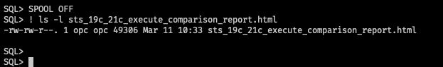

ブラウザでレポートを確認します。

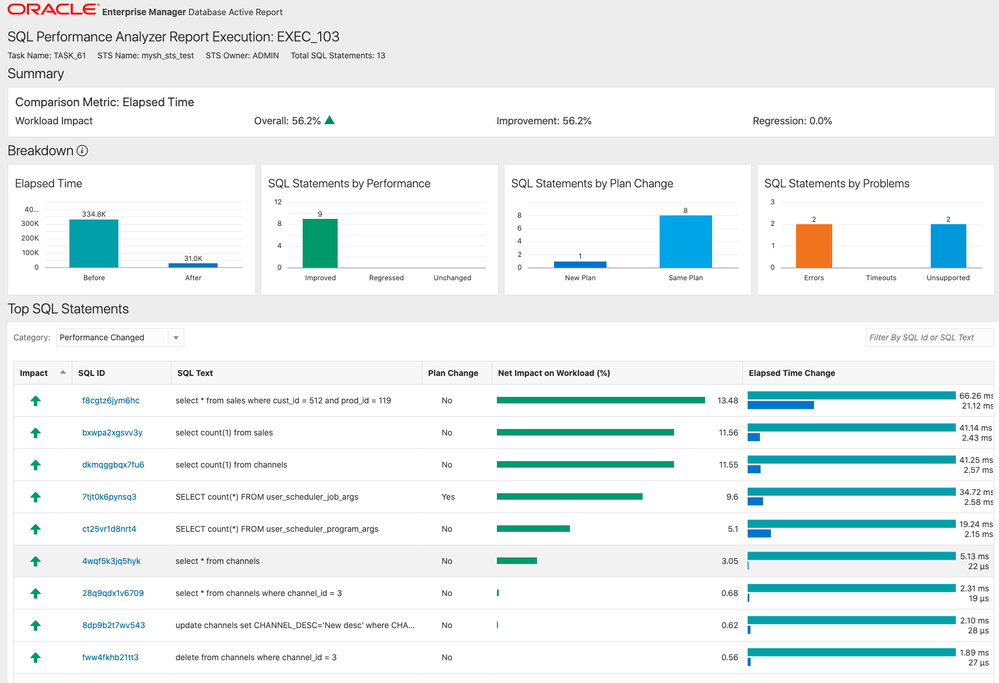

## クリーンアップ

いずれの場合も、SQLチューニングセットを削除する必要がある場合は、次の手順を実行して削除できます。

```sql
EXEC DBMS_SQLTUNE.DROP_SQLSET('mysh_sts_test');
```

`ORA-13757: "SQL Tuning Set" "mysh_sts_test" owned by user "ADMIN" is active.` というエラーが発生した場合は次のステートメントを実行してSTSの参照を検索し、参照を削除します。 次に、STSを削除できます。

```sql
select description, created, owner
from DBA_SQLSET_REFERENCES
where sqlset_name = 'mysh_sts_test';

EXEC DBMS_SQLTUNE.DROP_TUNING_TASK('TASK_53');

EXEC DBMS_SQLTUNE.DROP_SQLSET('mysh_sts_test');
```

次のステートメントを実行すると、特定のSQL Tuning Setが存在するかどうかを確認できます。

```sql
SELECT COUNT(*) 
FROM   USER_SQLSET 
WHERE  NAME = 'mysh_sts_test';
```

## 補足

上記の例では、SQLステートメントに対して多くのフィルターを実行しませんでした。 `SELECT`などの特定のタイプのSQLステートメントをフィルタリングする場合は、次のように実行できます。

```sql
DECLARE
    l_cursor  DBMS_SQLTUNE.sqlset_cursor;
BEGIN
    OPEN l_cursor FOR
    SELECT VALUE(a) FROM   TABLE(
        DBMS_SQLTUNE.select_cursor_cache(
        basic_filter=> 'upper(SQL_TEXT) not like
        ''%SQL_ANALYZE%''
        and upper(SQL_TEXT) not like ''%BEGIN%''
        and upper(SQL_TEXT) not like ''%DBMS_SQLTUNE%''
        and upper(SQL_TEXT) like ''%SELECT%''
        and upper(parsing_schema_name) = ''MYSH''',
        attribute_list => 'ALL')) a;
    DBMS_SQLTUNE.load_sqlset(sqlset_name=>
        'mysh_sts_test',populate_cursor => l_cursor);
END;
/
```

したがって、`SELECT`ステートメントのみをSQL Tuning Setにキャプチャし、キャプチャされた`SELECT`ステートメントのみがレポートで分析および評価されます。

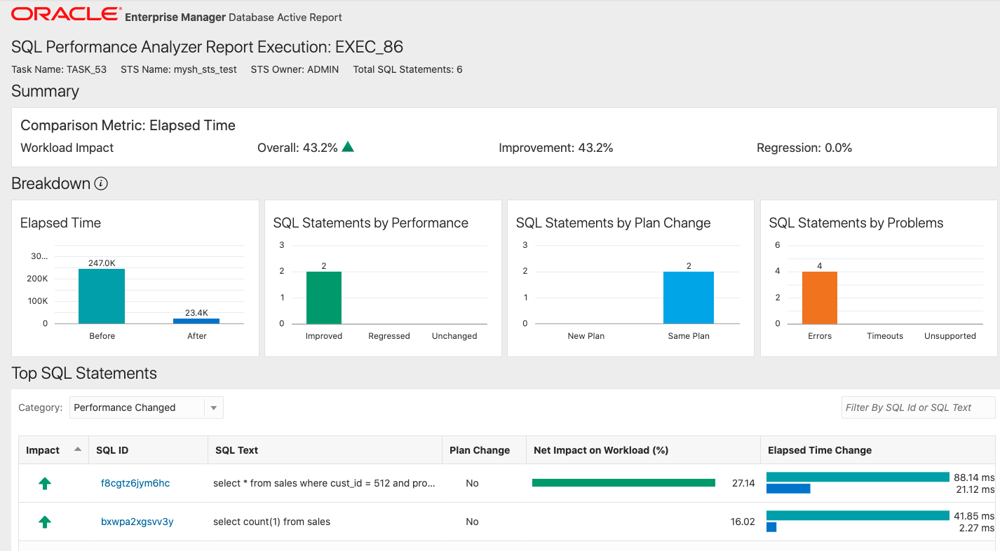

## 参照資料

- [DBMS_SQLTUNE](https://docs.oracle.com/en/database/oracle/oracle-database/19/arpls/DBMS_SQLTUNE.html#GUID-821462BF-1695-41CF-AFF7-FD23E9999C6A)
- [DBMS_SQLPA](https://docs.oracle.com/en/database/oracle/oracle-database/19/arpls/DBMS_SQLPA.html#GUID-9AAF3672-1CF3-4354-AF41-5BA50BA295F8)
- [Use Oracle Data Pump to Export Data to Object Store Setting DEFAULT_CREDENTIAL Property](https://docs.oracle.com/en/cloud/paas/autonomous-database/adbsa/export-data-object-store-dp.html#GUID-9D1768A7-9FDE-448D-9925-C85FD48383E6)
- [Import Data Using Oracle Data Pump on Autonomous Database](https://docs.oracle.com/en/cloud/paas/autonomous-database/adbsa/load-data-data-pump.html#GUID-30DB1EEA-DB45-49EA-9E97-DF49A9968E24)
- [ORA-13757: Can't drop SQL Tuning Set (Doc ID 1276524.1)](https://support.oracle.com/epmos/faces/DocContentDisplay?id=1276524.1)
